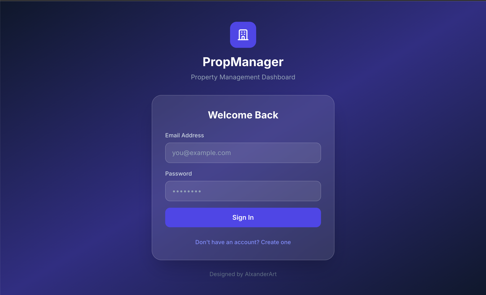
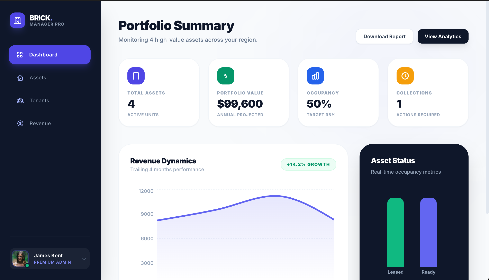
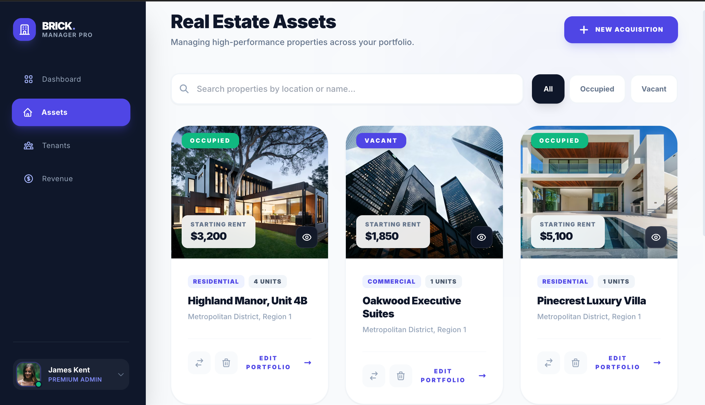
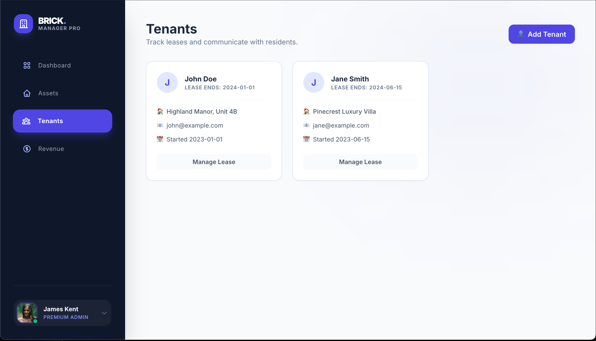
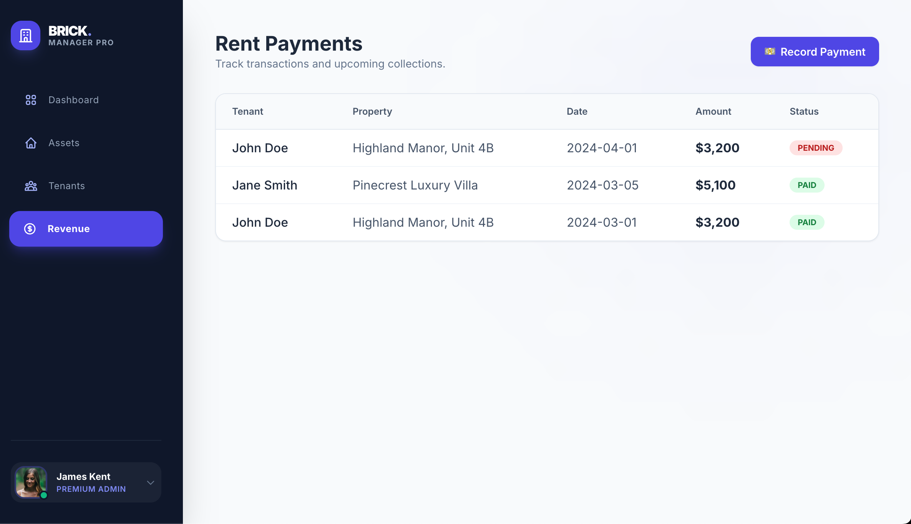

# Property Manager Lite 🏢

**Designed by [@AlxanderArt](https://github.com/AlxanderArt)**

[](https://property-manager-lite.vercel.app)
[](https://property-manager-lite.vercel.app)
[](https://property-management-ux-ui-project.onrender.com)

A modern, full-stack property management system designed for small portfolio owners and landlords. Features JWT authentication, real-time analytics, and a beautiful responsive UI.

## 🚀 Live Demo — **Deployed & Working!**

> ✅ **This application is fully deployed and functional!**

| Service | URL | Status |
|---------|-----|--------|
| **Frontend** | [property-manager-lite.vercel.app](https://property-manager-lite.vercel.app) | 🟢 Live |
| **Backend API** | [property-management-ux-ui-project.onrender.com](https://property-management-ux-ui-project.onrender.com) | 🟢 Live |

### Try It Now
1. Visit the [Live Demo](https://property-manager-lite.vercel.app)
2. Click **"Create Account"** to register
3. Log in and start managing properties!

> **Note:** Free tier backend may take ~30 seconds to wake up on first request after inactivity.

## 📸 Screenshots

### Login
Secure authentication with a beautiful dark-themed interface.


### Dashboard
Analytics overview with revenue trends, occupancy rates, and key metrics.


### Property Assets
Manage your real estate portfolio with full CRUD operations.


### Tenant Management
Track tenants, lease dates, and property assignments.


### Revenue Tracking
Monitor payments, track pending amounts, and view transaction history.


## 🛠 Tech Stack

| Layer | Technologies |
|-------|-------------|
| **Frontend** | React 19, TypeScript, Vite, Tailwind CSS, Recharts |
| **Backend** | Python 3.11, Flask, SQLAlchemy ORM, Flask-JWT-Extended |
| **Database** | SQLite (dev), PostgreSQL-ready |
| **Testing** | Pytest (backend), Vitest + React Testing Library (frontend) |
| **Deployment** | Vercel (frontend), Render (backend) |

## ✨ Features

### Current Features
- **User Authentication** - Secure JWT-based login and registration
- **Property Management** - Full CRUD for property listings with images
- **Tenant Tracking** - Manage tenant details, link to properties
- **Lease Management** - Track lease start and end dates
- **Payment Recording** - Log payments with status tracking (paid/pending)
- **Dashboard Analytics** - Visual charts for revenue trends and occupancy
- **Responsive Design** - Mobile-first, works on all screen sizes

### Planned Features

| Feature | Status | Priority |
|---------|--------|----------|
| User Authentication | ✅ Implemented | - |
| Property CRUD | ✅ Implemented | - |
| Tenant Management | ✅ Implemented | - |
| Payment Tracking | ✅ Implemented | - |
| Dashboard Analytics | ✅ Implemented | - |
| Document Storage (PDFs) | 🔜 Planned | High |
| Email Notifications | 🔜 Planned | Medium |
| Payment Gateway (Stripe) | 🔜 Planned | Medium |
| Multi-user Roles | 🔜 Planned | Low |

## 📂 Project Structure

```text
property-manager-lite/
├── App.tsx                 # Main React entry with auth & routing
├── pages/
│   ├── Login.tsx          # Authentication UI
│   ├── Dashboard.tsx      # Analytics & metrics
│   ├── Properties.tsx     # Property management
│   ├── Tenants.tsx        # Tenant directory
│   └── Payments.tsx       # Payment tracking
├── services/
│   ├── api.ts             # Real API client
│   ├── auth.ts            # Authentication service
│   └── mockApi.ts         # Mock data for development
├── components/
│   └── Layout.tsx         # Navigation & layout
├── tests/                  # Frontend tests
├── backend/
│   ├── app.py             # Flask API with JWT auth
│   ├── models.py          # SQLAlchemy models
│   ├── requirements.txt   # Python dependencies
│   ├── Procfile           # Render deployment
│   └── tests/             # Backend tests
├── docs/screenshots/       # App screenshots
└── vercel.json            # Vercel deployment config
```

## ⚙️ Setup Instructions

### Backend (Python/Flask)

```bash
cd backend
python -m venv venv
source venv/bin/activate  # Windows: venv\Scripts\activate
pip install -r requirements.txt

# Set environment variables (optional)
export JWT_SECRET_KEY=your-secret-key
export FLASK_DEBUG=true

python app.py
# API available at http://localhost:5000
```

### Frontend (React/Vite)

```bash
npm install

# Set API URL (optional, defaults to localhost:5000)
echo "VITE_API_URL=http://localhost:5000" > .env.local

npm run dev
# App available at http://localhost:3000
```

## 🧪 Testing

### Backend Tests
```bash
cd backend
pytest tests/test_app.py -v
```

### Frontend Tests
```bash
npm test
# or with UI
npm run test:ui
```

## 🚀 Deployment

### Deploy Backend to Render
1. Connect your GitHub repo to Render
2. Select "Web Service" and choose the `/backend` directory
3. Set environment variables:
   - `JWT_SECRET_KEY`: Generate a secure random string
   - `CORS_ORIGINS`: Your Vercel frontend URL

### Deploy Frontend to Vercel
1. Import your GitHub repo to Vercel
2. Framework preset: Vite
3. Set environment variable:
   - `VITE_API_URL`: Your Render backend URL

## 🔧 How to Extend

### Adding a New Model

1. **Define the model** in `backend/models.py`:
```python
class Maintenance(db.Model):
    id = db.Column(db.Integer, primary_key=True)
    property_id = db.Column(db.Integer, db.ForeignKey('properties.id'))
    description = db.Column(db.String(500))
    status = db.Column(db.String(50), default='pending')
```

2. **Add API routes** in `backend/app.py`:
```python
@app.route('/maintenance', methods=['GET', 'POST'])
@jwt_required()
def maintenance():
    # Implementation here
```

3. **Add TypeScript interface** in `types.ts`:
```typescript
export interface Maintenance {
  id: string;
  propertyId: string;
  description: string;
  status: 'pending' | 'completed';
}
```

4. **Add API methods** in `services/api.ts`:
```typescript
getMaintenance: async () => fetch(...),
createMaintenance: async (data) => fetch(...)
```

5. **Create page component** in `pages/Maintenance.tsx`

6. **Add navigation** in `components/Layout.tsx`

### Adding a New Page

1. Create `pages/NewPage.tsx` with your component
2. Import in `App.tsx` and add conditional render
3. Add nav item in `Layout.tsx` with icon

## 📝 API Endpoints

| Method | Endpoint | Description | Auth |
|--------|----------|-------------|------|
| POST | `/auth/register` | Create new user | No |
| POST | `/auth/login` | Get JWT token | No |
| GET | `/auth/me` | Get current user | Yes |
| GET | `/properties` | List all properties | Yes |
| POST | `/properties` | Create property | Yes |
| PUT | `/properties/:id` | Update property | Yes |
| DELETE | `/properties/:id` | Delete property | Yes |
| GET | `/tenants` | List all tenants | Yes |
| POST | `/tenants` | Create tenant | Yes |
| GET | `/payments` | List all payments | Yes |
| POST | `/payments` | Create payment | Yes |

## 📄 License

MIT License - feel free to use this project for learning or as a starting point for your own property management system.

---

**Built with React, Flask, and lots of coffee by AlxanderArt**
